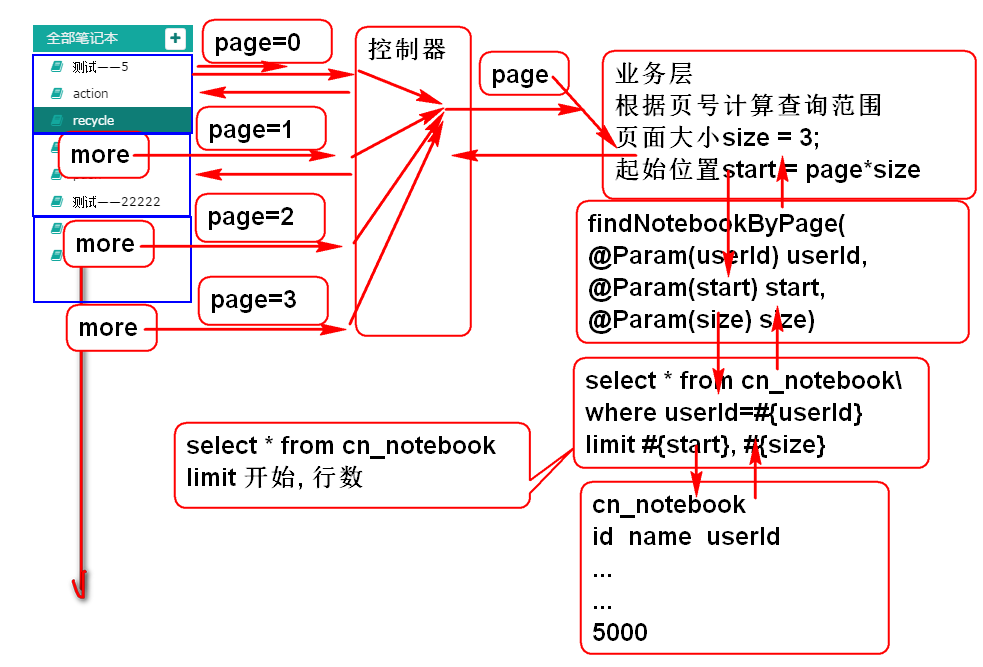
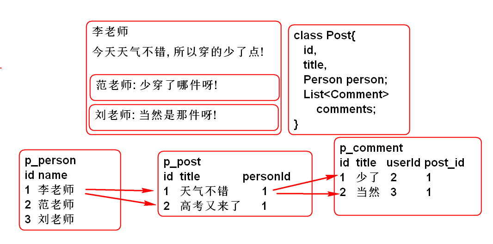

# 云笔记

## JQuery Ajax 上传

利用JQuery可以实现Ajax上传, 案例如下:

	<!DOCTYPE html>
	<html>
	<head>
	<meta charset="UTF-8">
	<title>JQuery Ajax Upload</title>
	
	
	</head>
	<body>
		<h1>JQuery Ajax Upload</h1>
		<input type="file" id="file1">  
		<input type="file" id="file2">  
		

		<input type="button" value="上载文件" id="ajaxUpload">
	</body>
	</html>

> 服务器端使用上节课的案例

## 服务端Debug

使用步骤:

1. 在Java应用代码上打断点
2. 将Tomcat启动为 Debug 模式
3. 利用事件触发调试代码的执行, Eclipse会在断点位置暂停.
4. 切换为Debug工作台, 利用内存变量查看功能变量的值, 估算BUG位置
5. 利用调试功能按钮逐步执行程序, 检查变量的值.

> 注意: Debug核心功能就是检查程序运行期间内存中变量的值, 具体BUG要你根据变量的值推断得出.

> 技巧: 清除全部断点

## 翻页功能实现

翻页原理:

### 1. 持久层

1. 定义接口方法 NotebookDao

		/**
		 * 分页查询方法
		 * @param userId
		 * @param start 起始位置
		 * @param size 每页查询行数
		 * @return
		 */
		List<Map<String, Object>> findNotebookByPage(
				@Param("userId") String userId,
				@Param("start") int start,
				@Param("size") int size);

2. 定义SQL NotebookMapper.xml

		<select id="findNotebookByPage"
			resultType="map">
			select 
				cn_notebook_id as id, 
				cn_notebook_name as name
			from 
				cn_notebook
			where 
				cn_user_id=#{userId}
			order by 
				cn_notebook_createtime desc
			limit #{start}, #{size}
		</select>
	
3. 测试

		...

### 2. 业务层

1. 定义业务层方法 NotebookService
	
		/**
		 * 分页查询方法
		 * @param userId
		 * @param page 是页号: 0 1 2 3 4 ...
		 * @return
		 * @throws UserNotFoundException
		 */
		List<Map<String, Object>> listNotebooks(
				String userId, int page) 
				throws UserNotFoundException;

2. 实现业务方法 NotebookServiceImpl

		@Transactional(readOnly=true)
		public List<Map<String, Object>> 
			listNotebooks(String userId, int page) 
			throws UserNotFoundException {
			if(userId==null || userId.trim().isEmpty()){
				throw new UserNotFoundException("ID空");
			}
			User user = userDao.findUserById(userId);
			if(user==null){
				throw new UserNotFoundException("ID不存在");
			}
			
			//计算分页范围
			int size = 3;
			int start = size * page;
			
			return notebookDao.findNotebookByPage(
					userId, start, size); 
		}
	
3. 测试 TestNotebookService:

		@Test
		public void testFindByPage(){
			String userId="333c6d0b-e4a2-4596-9902-a5d98c2f665a";
			int page = 1;
			List<Map<String, Object>> list=
				service.listNotebooks(userId, page);
			for (Map<String, Object> map : list) {
				System.out.println(map);
			}
		}

### 3. 控制器

1. NotebookController

		@RequestMapping("/page.do")
		@ResponseBody
		public JsonResult page(String userId, int page){
			//调用业务层 notebookService
			List<Map<String, Object>> list=
				notebookService.listNotebooks(userId, page);
			return new JsonResult(list);
		}

### 4. 页面JS

1. 重构, 在页面启动时候调用分页显示方法
	
		//调用方法加载笔记本列表
		loadPagedNotebooks();

2. 实现分页加载笔记本方法
		
		function loadPagedNotebooks(){
			//获取li.data('page'), 如果没有则是第一页
			var more = $(this);
			var page = 0;
			if(more.data('page')){
				page = more.data('page');
			}
			//page数据是 showPagedNotebooks 方法绑定到more按钮上的
			
			var url = "notebook/page.do";
			var data = {userId: getCookie('userId'), 
					page: page };
			$.getJSON(url, data, function(result){
				if(result.state==SUCCESS){
					var notebooks = result.data;
					showPagedNotebooks(notebooks, page);
				}else{
					alert(result.message);
				}
			});
		}

3. 实现分页显示笔记本列表方法

		function showPagedNotebooks(notebooks, page){
			//把数据显示到 笔记本 列表区域
			var ul = $('#pc_part_1 .contacts-list');
			if(page==0){
				ul.empty();
			}else{
				//删除 <li class=more >元素
				ul.find('.more').remove();
			}
			//显示 每个笔记本
			for(var i=0; i<notebooks.length; i++){
				var notebook = notebooks[i];
				var li = notebookTemplate.replace(
					'[name]', notebook.name);
				//绑定笔记本Id到li
				li = $(li).data('notebookId', notebook.id);
				ul.append(li);
			}
			//在more上绑定 page+1;
			var more = $(moreTemplate);
			more.data('page', page+1);
			//显示more按钮
			if(notebooks.length!=0){
				ul.append(more);
			}
		}
		
		var moreTemplate = '<li class="online more">'+
			'<a>'+
			'<i class="fa fa-plus" title="online" '+
				' rel="tooltip-bottom">'+
			'</i> 加载更多</a></li>'
		
		var notebookTemplate=
			'<li class="online notebook">'+
			'<a>'+
			'<i class="fa fa-book" title="online" '+
				' rel="tooltip-bottom">'+
			'</i> [name]</a></li>';
	
	> 为了编译绑定事件, 重构显示模板, 增加了li 的 class: notebook more

4. 重构事件绑定:

		//利用事件冒泡,绑定li被点击时候执行事件程序
		//绑定笔记本列表中li元素被点击的事件
		$('#pc_part_1').on('click',
				'li.notebook',loadNotes);
		//监听翻页请求 more
		$('#pc_part_1').on('click',
				'li.more', loadPagedNotebooks); 

## 选择器

1. li
2. #note
3. .more
4. ul li 多层
5. ul>li 一层派生选择器
6. li, a
7. li.more 选择元素是li并且class是more的元素
8. li#user

## MyBatis 支持了自增类型列

可以在保存对象时候, 自动的将生成自增的ID读取回来.

如: 
	
	Person p = new Person("范传奇");
	personDao.addPerson(p);//保存preson到数据库
	//  自动的将生成自增的ID读取回来.
	System.out.println(person.getId()); //3

完整案例:

1. 建表, 包含自增类型ID

		create table p_person(
		    id int not null AUTO_INCREMENT,
		    name varchar(100),
		    primary key(id)
		);

2. 创建实体类 Person

		public class Person implements Serializable{
			private static final long serialVersionUID = -46131913216270686L;
			
			private Integer id;
			private String name;
			
			public Person() {
			}
		
			public Person(String name) {
				super();
				this.name = name;
			}
		
			public Integer getId() {
				return id;
			}
		
			public void setId(Integer id) {
				this.id = id;
			}
		
			public String getName() {
				return name;
			}
		
			public void setName(String name) {
				this.name = name;
			}
		
			@Override
			public int hashCode() {
				final int prime = 31;
				int result = 1;
				result = prime * result + ((id == null) ? 0 : id.hashCode());
				return result;
			}
		
			@Override
			public boolean equals(Object obj) {
				if (this == obj)
					return true;
				if (obj == null)
					return false;
				if (getClass() != obj.getClass())
					return false;
				Person other = (Person) obj;
				if (id == null) {
					if (other.id != null)
						return false;
				} else if (!id.equals(other.id))
					return false;
				return true;
			}
		
			@Override
			public String toString() {
				return "Person [id=" + id + ", name=" + name + "]";
			}
		}

3. 定义PersonDao

		public interface PersonDao {
			
			int addPerson(Person person);
			
		}

4. 定义SQL PersonMapper.xml
	 
		 <!-- useGeneratedKeys 用于支持自增类型ID类的
		 属性, keyProperty用于设置Person中的自增的Bean属性
		 MyBatis会自动的将自动生成的ID赋值到Person的id属性 -->
		 <insert id="addPerson"
		 	parameterType="cn.tedu.cloudnote.entity.Person"
		 	useGeneratedKeys="true"
		 	keyProperty="id">
		 	insert into p_person
		 		(id, name)
		 	values
		 		(null, #{name})
		 </insert>

5. 测试 

		public class TestPersonDao extends TestCaseBase {
			
			PersonDao dao;
			
			@Before
			public void initDao(){
				dao = ctx.getBean("personDao", PersonDao.class);
			}
			
			@Test
			public void testAddPerson(){
				Person p = new Person("刘老师");
				//不用为p设置ID属性!
				int n = dao.addPerson(p);
				//MyBatis会自动返回自动增加的ID
				System.out.println(p); 
			}
			
		}

	> 结果: 经过测试可以发现, MyBatis 可以将自动生成的ID返回.

## 关联映射

MyBatis支持复杂关联映射:

关联映射查询: 一次查询就可以将Post对象的复杂引用关系查询回来:

定义SQL, 并且初始化数据: 
	
	create table p_person(
	    id int not null AUTO_INCREMENT,
	    name varchar(100),
	    primary key(id)
	);
	
	insert into p_person (name) values ('李老师');
	insert into p_person (id, name) values (null,'李老师');
	
	
	create table p_comment(
	    id int not null AUTO_INCREMENT,
	    title varchar(100),
	    post_id int,
	    primary key(id)
	);
	
	create table p_post(
	    id int not null AUTO_INCREMENT, 
	    title varchar(100),
	    person_id int,
	    primary key(id)
	);
	
	insert into p_post (id, title, person_id)
	    values (null, '今天天气不错', 1);
	    
	insert into p_post (id, title, person_id)
	    values (null, '高考又来了', 1);
	    
	insert into p_comment(id, title, post_id)
	    values ( null, '少穿了哪一件呀?', 1);
	    
	insert into p_comment(id, title, post_id)
	    values (null, '冻成狗', 1);
	insert into p_comment(id, title, post_id)
	    values (null, '喜欢下雪', 1);

实现复杂关联查询:

1. 实体类

		public class Person implements Serializable{
			private static final long serialVersionUID = -46131913216270686L;
			
			private Integer id;
			private String name;
			
			public Person() {
			}
		
			public Person(String name) {
				super();
				this.name = name;
			}
		
			public Integer getId() {
				return id;
			}
		
			public void setId(Integer id) {
				this.id = id;
			}
		
			public String getName() {
				return name;
			}
		
			public void setName(String name) {
				this.name = name;
			}
		
			@Override
			public int hashCode() {
				final int prime = 31;
				int result = 1;
				result = prime * result + ((id == null) ? 0 : id.hashCode());
				return result;
			}
		
			@Override
			public boolean equals(Object obj) {
				if (this == obj)
					return true;
				if (obj == null)
					return false;
				if (getClass() != obj.getClass())
					return false;
				Person other = (Person) obj;
				if (id == null) {
					if (other.id != null)
						return false;
				} else if (!id.equals(other.id))
					return false;
				return true;
			}
		
			@Override
			public String toString() {
				return "Person [id=" + id + ", name=" + name + "]";
			}
		}
		
		
		public class Comment implements Serializable {
			private static final long serialVersionUID = -5881249634665160256L;
			
			private Integer id;
			private String title;
			
			public Comment() {
			}
		
			public Comment(String title) {
				super();
				this.title = title;
			}
		 
		
			public Integer getId() {
				return id;
			}
		
			public void setId(Integer id) {
				this.id = id;
			}
		
			public String getTitle() {
				return title;
			}
		
			public void setTitle(String title) {
				this.title = title;
			}
		
			@Override
			public int hashCode() {
				final int prime = 31;
				int result = 1;
				result = prime * result + ((id == null) ? 0 : id.hashCode());
				return result;
			}
		
			@Override
			public boolean equals(Object obj) {
				if (this == obj)
					return true;
				if (obj == null)
					return false;
				if (getClass() != obj.getClass())
					return false;
				Comment other = (Comment) obj;
				if (id == null) {
					if (other.id != null)
						return false;
				} else if (!id.equals(other.id))
					return false;
				return true;
			}
		
			@Override
			public String toString() {
				return "Comment [id=" + id + ", title=" + title + "]";
			}
		 
		}
		
		
		public class Post implements Serializable{
			private static final long serialVersionUID = -4722438109030592372L;
			
			private Integer id;
			private String title;
			
			/** 发帖人 */
			private Person person;
			
			/** 当前帖子收到的回复 */
			private List<Comment> comments = 
					new ArrayList<Comment>();
			
			public Post() {
			}
		
			public Integer getId() {
				return id;
			}
		
			public void setId(Integer id) {
				this.id = id;
			}
		
			public String getTitle() {
				return title;
			}
		
			public void setTitle(String title) {
				this.title = title;
			}
		
			public Person getPerson() {
				return person;
			}
		
			public void setPerson(Person person) {
				this.person = person;
			}
		
			public List<Comment> getComments() {
				return comments;
			}
		
			public void setComments(List<Comment> comments) {
				this.comments = comments;
			}
		
			@Override
			public String toString() {
				return "Post [id=" + id + ", title=" + title + ", person=" + person + ", comments=" + comments + "]";
			}
		
			@Override
			public int hashCode() {
				final int prime = 31;
				int result = 1;
				result = prime * result + ((id == null) ? 0 : id.hashCode());
				return result;
			}
		
			@Override
			public boolean equals(Object obj) {
				if (this == obj)
					return true;
				if (obj == null)
					return false;
				if (getClass() != obj.getClass())
					return false;
				Post other = (Post) obj;
				if (id == null) {
					if (other.id != null)
						return false;
				} else if (!id.equals(other.id))
					return false;
				return true;
			}
		}

2. 定义查询接口方法 PersonDao

		Post findPostById(Integer id);

3. 定义基本属性查询映射 PersonMapper.xml:

		 <!-- 利用 resultMap 进行自定义映射 -->
		 <resultMap type="cn.tedu.cloudnote.entity.Post" 
		 	id="postMap">
		 	<!-- 映射 Post 的主键id -->
		 	<id column="id" property="id"/>
		 	<!-- 映射 普通列Post 的 title -->
		 	<result column="title" property="title"/>
		 </resultMap>
		 
		 <!-- 复杂映射必须指定 resultMap:postMap  -->
		 <select id="findPostById"
		 	parameterType="int"
		 	resultMap="postMap">
		 	select 
		 		po.id,
		 		po.title,
		 		pe.id as person_id,
		 		pe.name
		 	from 
		 		p_post po
		 	left join p_person pe 
		 		on po.person_id = pe.id
		 	where 
		 		po.id = #{id}
		 </select>

4. 测试 TestPersonDao
		
		@Test
		public void testFindPostById(){
			Post post = dao.findPostById(1);
			System.out.println(post); 
		}

		测试结果:
			Post [id=1, title=今天天气不错, person=null, comments=[]]

	> 说明: 成功映射了基本属性 id 和 title, 但是person和comments属性没有映射成功.

5. 映射person属性: 重构ResultMap 利用 association 元素映射 person属性: 

		 <!-- 利用 resultMap 进行自定义映射 -->
		 <resultMap type="cn.tedu.cloudnote.entity.Post" 
		 	id="postMap">
		 	<!-- 映射 Post 的主键id -->
		 	<id column="id" property="id"/>
		 	<!-- 映射 普通列Post 的 title -->
		 	<result column="title" property="title"/>

			<!-- 映射 person 属性 -->
		 	<association property="person" 
		 		javaType="cn.tedu.cloudnote.entity.Person">
		 		<!-- Person 的主键 id -->
		 		<id column="person_id" property="id"/>
		 		<!-- 映射普通列Person 的 name -->
		 		<result column="name" property="name"/> 
		 	</association>

		 </resultMap>

	> 将SQL查询结果的 person_id 和 name 列映射到Person的id和name属性.

6. 测试 testFindPostById() 方法:

		测试结果:
		Post [id=1, title=今天天气不错, person=Person [id=1, name=李老师], comments=[]]

	> 说明: 进一步成功的映射了 person属性, 不再为null了

7. 映射 comments 属性: 利用collection属性映射commons集合, 为了配合collection属性, 增加一个 select 元素定义SQL查询: 

		 <!-- 利用 resultMap 进行自定义映射 -->
		 <resultMap type="cn.tedu.cloudnote.entity.Post" 
		 	id="postMap">
		 	<!-- 映射 Post 的主键id -->
		 	<id column="id" property="id"/>
		 	<!-- 映射 普通列Post 的 title -->
		 	<result column="title" property="title"/>
	 
		 	<association property="person" 
		 		javaType="cn.tedu.cloudnote.entity.Person">
		 		<!-- Person 的主键 id -->
		 		<id column="person_id" property="id"/>
		 		<!-- 映射普通列Person 的 name -->
		 		<result column="name" property="name"/> 
		 	</association>
		 	
		 	<!-- collection 映射List集合 利用到 另外一个查询
		 	findComments 查询结果 
		 	column="id" 是传递给findComments查询的参数-->
	
		 	<collection property="comments" 
		 		select="findComments" column="id"></collection>
	
		 </resultMap>
		 
		 <!-- 此SQL查询的ID 与上面collection 的select属性一致 -->
		 <select id="findComments" 
		 	parameterType="int"
		 	resultType="cn.tedu.cloudnote.entity.Comment">
			select 
				id,
				title
			from 
				p_comment
			where 
				post_id = #{id}
		 </select>		

8. 测试 testFindPostById() 方法:

		测试结果:
		Post [id=1, title=今天天气不错, person=Person [id=1, name=李老师], comments=[Comment [id=1, title=少穿了哪一件呀?], Comment [id=2, title=冻成狗], Comment [id=3, title=喜欢下雪]]]

	> 说明: 进一步成功的映射了 comments属性, 不再为空集[]了

9. Good Luck! 

----------------------------

## 作业

1. 实现笔记本的分页查询
2. 实现复杂关联映射案例

		